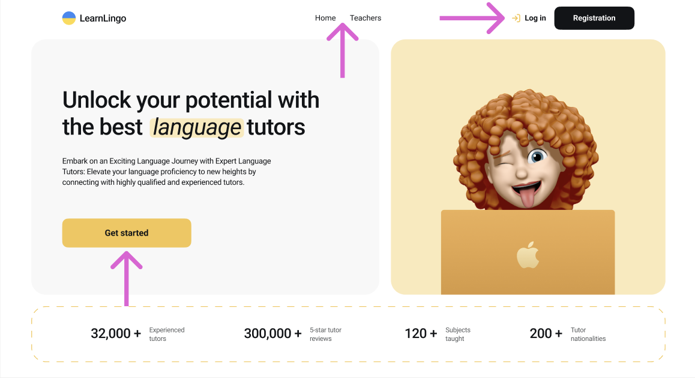
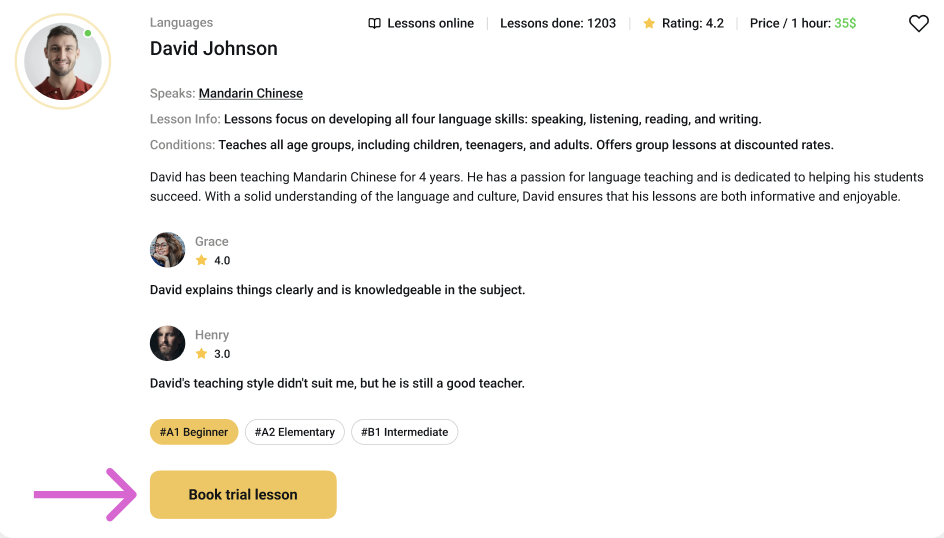
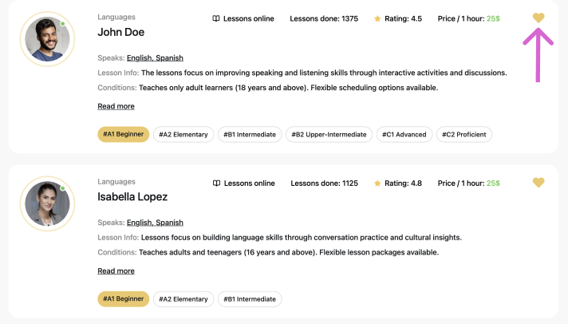
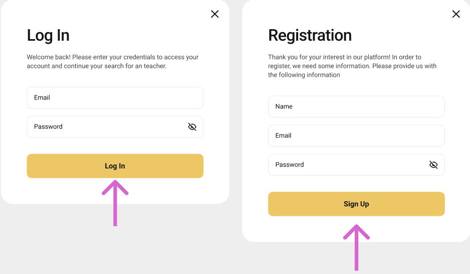
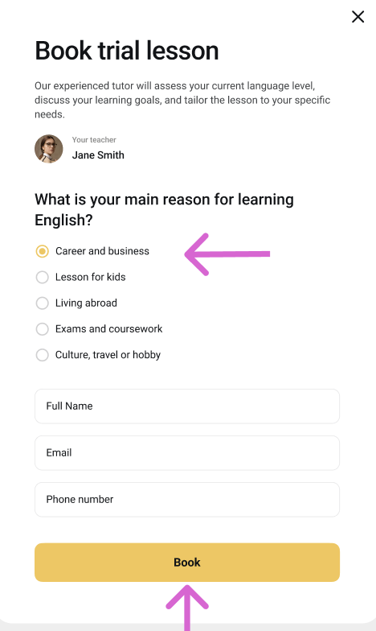

# LearnLingo

### LearnLingo is a web application for finding online language tutors and booking trial lessons.

Users can browse available teachers, filter them by teaching language, student level and lesson price, view detailed teacher information and reviews, add teachers to favorites, and book a trial lesson.

### Home Page

> The Home page introduces the LearnLingo platform and its main advantages. The page contains a call-to-action that redirects users to the Teachers page.

### Teachers Page

> The Teachers page contains a list of available language tutors.

Users can:

- browse teacher cards
- filter teachers
- load more teachers
- add teachers to favorites
- remove teachers from favorites
- read detailed teacher information
- view student reviews
- book a trial lesson

Four teacher cards are loaded initially. Additional cards are loaded after clicking the "Load more" button.

### Favorites Page

> Favorites is a private page available only to authenticated users. It contains all teachers added to the user's favorites. The favorites state is preserved after page reload.

### Authentication

> Authentication is implemented using Firebase.

Users can:

- create an account
- log in
- log out
- get the current authenticated user

Favorite functionality is available only to authenticated users.

If an unauthenticated user tries to add a teacher to favorites, the application displays a notification informing them that authentication is required.

## Booking

> Authenticated users can book a trial lesson with a selected teacher.

The booking form contains:

- Full Name
- Email
- Phone number
- Reason for learning English

After successful submission, the user sees a confirmation message.

## Form Validation

Forms are implemented using:

- React Hook Form
- Yup

All form fields are required and validated before submission.

The application validates:

- name
- email
- password
- phone number
- booking information

## Features

- User registration and login
- Firebase authentication
- Getting information about the current authenticated user
- Logout functionality
- Teachers catalog
- Filtering teachers by:
  * teaching language
  * student level
  * lesson price
- Pagination with "Load more"
- Add and remove teachers from favorites
- Persistent favorites after page reload
- Private Favorites page for authenticated users
- Detailed teacher information
- Student reviews
- Trial lesson booking
- Form validation
- Responsive modal windows
- Modal closing by:
  * close button
  * backdrop click
  * `Esc` key
- Protected routes for authenticated users

## Technologies

- React
- JavaScript
- Vite
- React Router
- Firebase
- React Hook Form
- Yup
- CSS Modules
- Git / GitHub

## Firebase

Firebase is used for:

- user authentication
- storing teacher data
- storing trial lesson booking information

The application works with Firebase Authentication and Realtime Database.

## Getting Started
